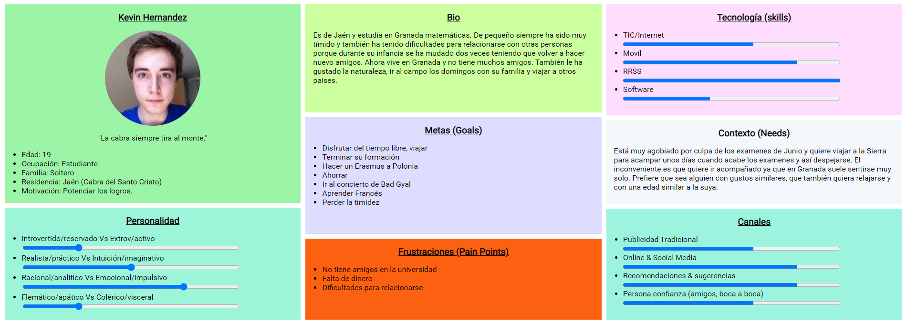
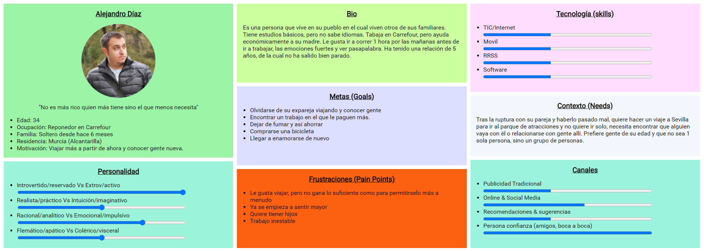
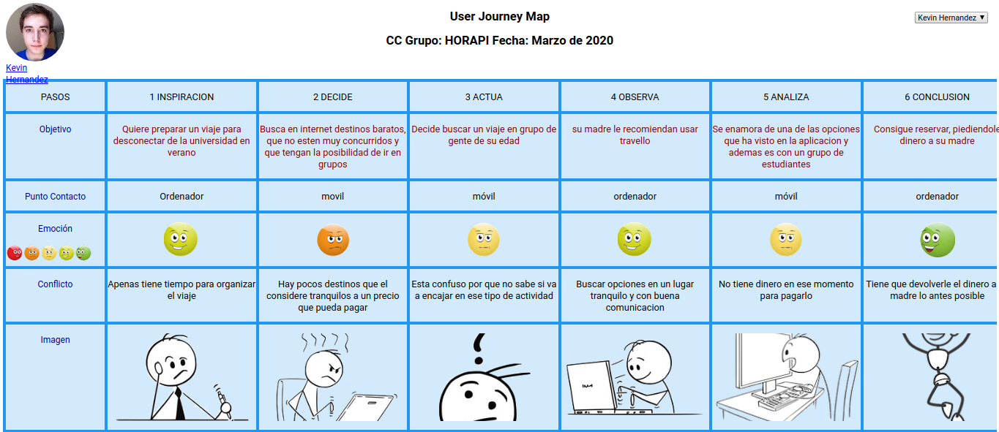
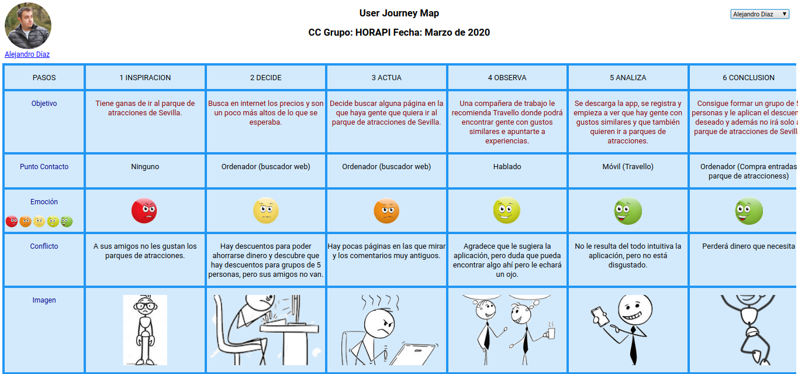

# DIU - Practica1. Análisis del Interfaz de Usuario. Revisión de Usabilidad

## 1. Análisis Competencia 
La aplicación que vamos a analizar es la de Travello, que es una red social para viajeros. El objetivo principal de la aplicación es conectar viajeros una vez llegan a su destino. Algunas de las funcionalidades de Travello son las siguientes:

- Descubrir otros viajeros cercanos.
- Compartir publicaciones estilo Facebook.
- Unirte a grupos de interés para interaccionar con otros usuarios.
- Descubrir ofertas de viaje.

En este caso de estudio vamos analizar la aplicación para generar nuevas ideas, evitar malas prácticas y aprender de las buenas. Después, realizaremos un rediseño u ofreceremos una nueva aplicación.

## 2. Personas 
Vamos a crear unas personas que encagen como usuarios de nuestra aplicación para poder utilizarlas para tener más empatía con el usuario.

## 3. User Journey Map
Vamos a ver como sería un ejemplo de las personas que hemos creado utilizando Travello para conocer sus dificultades y emociones utilizando la app y aprender que cosas hacen bien y cuáles no.

Haga click en cada imagen para visualizarlas mejor.

## 4. Revisión de Usabilidad 

| Travello                               |                                                                                                                                                                                            |  | Score                                     |   | Comments                                                                                                                                                 |
|----------------------------------------|--------------------------------------------------------------------------------------------------------------------------------------------------------------------------------------------|--|-------------------------------------------|---|----------------------------------------------------------------------------------------------------------------------------------------------------------|
|                                        |                                                                                                                                                                                            |  |                                           |   |                                                                                                                                                          |
|                                        | Hover over a guideline for more information, examples of good practice and importance to the overall user experience.                                                                      |  | N/A = not applicable or can't be assessed |   | Optional - Provide a short rational for the score, such as a description of the issues found; examples of good practice and the likely impact for users. |
|                                        |                                                                                                                                                                                            |  |                                           |   |                                                                                                                                                          |
| Features & functionality               |                                                                                                                                                                                            |  |                                           |   |                                                                                                                                                          |
|                                        |                                                                                                                                                                                            |  |                                           |   |                                                                                                                                                          |
| 1                                      | Features and functionality meet common user goals and objectives.                                                                                                                          |  | Moderate                                  |   |                                                                                                                                                          |
|                                        |                                                                                                                                                                                            |  |                                           |   |                                                                                                                                                          |
| 2                                      | Features and functionality support users desired workflows.                                                                                                                                |  | Poor                                      |   |                                                                                                                                                          |
|                                        |                                                                                                                                                                                            |  |                                           |   |                                                                                                                                                          |
| 3                                      | Frequently-used tasks are readily available (e.g. easily accessible from the homepage) and well supported (e.g. short cuts are available).                                                 |  | Poor                                      |   |                                                                                                                                                          |
|                                        |                                                                                                                                                                                            |  |                                           |   |                                                                                                                                                          |
| 4                                      | Users are adequately supported according to their level of expertise (e.g. short cuts for expert users, help and instructions for novice users).                                           |  | Moderate                                  |   |                                                                                                                                                          |
|                                        |                                                                                                                                                                                            |  |                                           |   |                                                                                                                                                          |
| 5                                      | Call to actions (e.g. register, add to basket, submit) are clear, well labelled and appear clickable.                                                                                      |  | Moderate                                  |   |                                                                                                                                                          |
|                                        |                                                                                                                                                                                            |  |                                           |   |                                                                                                                                                          |
| Homepage / starting page               |                                                                                                                                                                                            |  |                                           |   |                                                                                                                                                          |
|                                        |                                                                                                                                                                                            |  |                                           |   |                                                                                                                                                          |
| 6                                      | The Homepage / starting page provides a clear snapshot and overview of the content, features and functionality available.                                                                  |  | Good                                      |   |                                                                                                                                                          |
|                                        |                                                                                                                                                                                            |  |                                           |   |                                                                                                                                                          |
| 7                                      | The home page / starting page is effective in orienting and directing users to their desired information and tasks.                                                                        |  | Moderate                                  |   |                                                                                                                                                          |
|                                        |                                                                                                                                                                                            |  |                                           |   |                                                                                                                                                          |
| 8                                      | The homepage / starting page layout is clear and uncluttered with sufficient 'white space'.                                                                                                |  | Poor                                      |   |                                                                                                                                                          |
|                                        |                                                                                                                                                                                            |  |                                           |   |                                                                                                                                                          |
| Navigation                             |                                                                                                                                                                                            |  |                                           |   |                                                                                                                                                          |
|                                        |                                                                                                                                                                                            |  |                                           |   |                                                                                                                                                          |
| 9                                      | Users can easily access the site or application (e.g. the URL is predictable and is returned by search engines).                                                                           |  | Excellent                                 |   |                                                                                                                                                          |
|                                        |                                                                                                                                                                                            |  |                                           |   |                                                                                                                                                          |
| 10                                     | The navigational scheme (e.g. menu) is easy to find, intuitive and consistent.                                                                                                             |  | Moderate                                  |   |                                                                                                                                                          |
|                                        |                                                                                                                                                                                            |  |                                           |   |                                                                                                                                                          |
| 11                                     | The navigation has sufficient flexibility to allow users to navigate by their desired means (e.g. searching, browse by type, browse by name, most recent etc…).                            |  | Moderate                                  |   |                                                                                                                                                          |
|                                        |                                                                                                                                                                                            |  |                                           |   |                                                                                                                                                          |
| 12                                     | The site or application structure is clear, easily understood and addresses common user goals.                                                                                             |  | Moderate                                  |   |                                                                                                                                                          |
|                                        |                                                                                                                                                                                            |  |                                           |   |                                                                                                                                                          |
| 13                                     | Links are clear, descriptive and and well labelled.                                                                                                                                        |  | Good                                      |   |                                                                                                                                                          |
|                                        |                                                                                                                                                                                            |  |                                           |   |                                                                                                                                                          |
| 14                                     | Browser standard functions (e.g. 'back', 'forward', 'bookmark') are supported.                                                                                                             |  | Good                                      |   |                                                                                                                                                          |
|                                        |                                                                                                                                                                                            |  |                                           |   |                                                                                                                                                          |
| 15                                     | The current location is clearly indicated (e.g. breadcrumb, highlighted menu item).                                                                                                        |  | Good                                      |   |                                                                                                                                                          |
|                                        |                                                                                                                                                                                            |  |                                           |   |                                                                                                                                                          |
| 16                                     | Users can easily get back to the homepage or a relevant start point.                                                                                                                       |  | Excellent                                 |   |                                                                                                                                                          |
|                                        |                                                                                                                                                                                            |  |                                           |   |                                                                                                                                                          |
| 17                                     | A clear and well structure site map or index is provided (where necessary).                                                                                                                |  | Very poor                                 |   |                                                                                                                                                          |
|                                        |                                                                                                                                                                                            |  |                                           |   |                                                                                                                                                          |
| Search                                 |                                                                                                                                                                                            |  |                                           |   |                                                                                                                                                          |
|                                        |                                                                                                                                                                                            |  |                                           |   |                                                                                                                                                          |
| 18                                     | A consitent, easy to find and easy to use search function is available throughout (where desirable).                                                                                       |  | Good                                      |   |                                                                                                                                                          |
|                                        |                                                                                                                                                                                            |  |                                           |   |                                                                                                                                                          |
| 19                                     | The search interface is appropriate to meet user goals (e.g. multi-parameter, prioritised results, filtering search results).                                                              |  | Poor                                      |   |                                                                                                                                                          |
|                                        |                                                                                                                                                                                            |  |                                           |   |                                                                                                                                                          |
| 20                                     | The search facility deals well with common searchs (e.g. showing most popular results), misspellings and abbreviations.                                                                    |  | Poor                                      |   |                                                                                                                                                          |
|                                        |                                                                                                                                                                                            |  |                                           |   |                                                                                                                                                          |
| 21                                     | Search results are relevant, comprehensive, precise, and well displayed.                                                                                                                   |  | Moderate                                  |   |                                                                                                                                                          |
|                                        |                                                                                                                                                                                            |  |                                           |   |                                                                                                                                                          |
| Control & feedback                     |                                                                                                                                                                                            |  |                                           |   |                                                                                                                                                          |
|                                        |                                                                                                                                                                                            |  |                                           |   |                                                                                                                                                          |
| 22                                     | Prompt and appropriate feedback is given (e.g. following a successful or unsuccessful action).                                                                                             |  | Good                                      |   |                                                                                                                                                          |
|                                        |                                                                                                                                                                                            |  |                                           |   |                                                                                                                                                          |
| 23                                     | Users can easily undo, go back and change or cancel actions; or are at least given the chance to confirm an action before commiting (e.g. before placing an order).                        |  | Moderate                                  |   |                                                                                                                                                          |
|                                        |                                                                                                                                                                                            |  |                                           |   |                                                                                                                                                          |
| 24                                     | Users can easily give feedback (e.g. via email or an online feedback / contact us form).                                                                                                   |  | Moderate                                  |   |                                                                                                                                                          |
|                                        |                                                                                                                                                                                            |  |                                           |   |                                                                                                                                                          |
| Forms                                  |                                                                                                                                                                                            |  |                                           |   |                                                                                                                                                          |
|                                        |                                                                                                                                                                                            |  |                                           |   |                                                                                                                                                          |
| 25                                     | Complex forms and processes are broken up into readily understood steps and sections. Where a process is used a progress indicator is present with clear numbers or named stages.          |  | N/A                                       |   |                                                                                                                                                          |
|                                        |                                                                                                                                                                                            |  |                                           |   |                                                                                                                                                          |
| 26                                     | A minimal amount of information is requested and where required justification is given for asking for information (e.g. date of birth, telephone number).                                  |  | Moderate                                  |   |                                                                                                                                                          |
|                                        |                                                                                                                                                                                            |  |                                           |   |                                                                                                                                                          |
| 27                                     | Required and optional form fields are clearly indicated.                                                                                                                                   |  | Moderate                                  |   |                                                                                                                                                          |
|                                        |                                                                                                                                                                                            |  |                                           |   |                                                                                                                                                          |
| 28                                     | Appropriate input fields (e.g. calendar for date selection, drop down for selection) are used and required formats are indicated.                                                          |  | Excellent                                 |   |                                                                                                                                                          |
|                                        |                                                                                                                                                                                            |  |                                           |   |                                                                                                                                                          |
| 29                                     | Help and instructions (e.g. examples, information required) are provided where necessary.                                                                                                  |  | Good                                      |   |                                                                                                                                                          |
|                                        |                                                                                                                                                                                            |  |                                           |   |                                                                                                                                                          |
| Errors                                 |                                                                                                                                                                                            |  |                                           |   |                                                                                                                                                          |
|                                        |                                                                                                                                                                                            |  |                                           |   |                                                                                                                                                          |
| 30                                     | Errors are clear, easily identifiable and appear in appropriate location (e.g. adjacent to data entry field, adjacent to form, etc.).                                                      |  | N/A                                       |   |                                                                                                                                                          |
|                                        |                                                                                                                                                                                            |  |                                           |   |                                                                                                                                                          |
| 31                                     | Error messages are concise, written in easy to understand language and describe what's occurred and what action is necessary.                                                              |  | Good                                      |   |                                                                                                                                                          |
|                                        |                                                                                                                                                                                            |  |                                           |   |                                                                                                                                                          |
| 32                                     | Common user errors (e.g. missing fields, invalid formats, invalid selections) have been taken into consideration and where possible prevented.                                             |  | Moderate                                  |   |                                                                                                                                                          |
|                                        |                                                                                                                                                                                            |  |                                           |   |                                                                                                                                                          |
| 33                                     | Users are able to easily recover (i.e. not have to start again) from errors.                                                                                                               |  | Moderate                                  |   |                                                                                                                                                          |
|                                        |                                                                                                                                                                                            |  |                                           |   |                                                                                                                                                          |
| Content & text                         |                                                                                                                                                                                            |  |                                           |   |                                                                                                                                                          |
|                                        |                                                                                                                                                                                            |  |                                           |   |                                                                                                                                                          |
| 34                                     | Content available (e.g. text, images, video) is appropriate and sufficiently relevant, and detailed to meet user goals.                                                                    |  | Moderate                                  |   |                                                                                                                                                          |
|                                        |                                                                                                                                                                                            |  |                                           |   |                                                                                                                                                          |
| 35                                     | Links to other useful and relevant content (e.g. related pages or external websites) are available and shown in context.                                                                   |  | Good                                      |   |                                                                                                                                                          |
|                                        |                                                                                                                                                                                            |  |                                           |   |                                                                                                                                                          |
| 36                                     | Language, terminology and tone used is appropriate and readily understood by the target audience.                                                                                          |  | Poor                                      |   |                                                                                                                                                          |
|                                        |                                                                                                                                                                                            |  |                                           |   |                                                                                                                                                          |
| 37                                     | Terms, language and tone used are consitent (e.g. the same term is used throughout).                                                                                                       |  | Moderate                                  |   |                                                                                                                                                          |
|                                        |                                                                                                                                                                                            |  |                                           |   |                                                                                                                                                          |
| 38                                     | Text and content is legible and scanable, with good typography and visual contrast.                                                                                                        |  | Moderate                                  |   |                                                                                                                                                          |
|                                        |                                                                                                                                                                                            |  |                                           |   |                                                                                                                                                          |
| Help                                   |                                                                                                                                                                                            |  |                                           |   |                                                                                                                                                          |
|                                        |                                                                                                                                                                                            |  |                                           |   |                                                                                                                                                          |
| 39                                     | Online help is provided and is suitable for the user base (e.g. is written in easy to understand langugage and only uses recognised terms). Where appropriate contextual help is provided. |  | N/A                                       |   |                                                                                                                                                          |
|                                        |                                                                                                                                                                                            |  |                                           |   |                                                                                                                                                          |
| 40                                     | Online help is concise, easy to read and written in easy to understand language.                                                                                                           |  | N/A                                       |   |                                                                                                                                                          |
|                                        |                                                                                                                                                                                            |  |                                           |   |                                                                                                                                                          |
| 41                                     | Accessing online help does not impede users (i.e. they can can resume work where they left off after accessing help).                                                                      |  | Moderate                                  |   |                                                                                                                                                          |
|                                        |                                                                                                                                                                                            |  |                                           |   |                                                                                                                                                          |
| 42                                     | Users can easily get further help (e.g. telephone or email address).                                                                                                                       |  | Good                                      |   |                                                                                                                                                          |
|                                        |                                                                                                                                                                                            |  |                                           |   |                                                                                                                                                          |
| Performance                            |                                                                                                                                                                                            |  |                                           |   |                                                                                                                                                          |
|                                        |                                                                                                                                                                                            |  |                                           |   |                                                                                                                                                          |
| 43                                     | Site or application performance doesn't inhibit the user experience (e.g. slow page downloads, long delays).                                                                               |  | Good                                      |   |                                                                                                                                                          |
|                                        |                                                                                                                                                                                            |  |                                           |   |                                                                                                                                                          |
| 44                                     | Errors and reliabilty issues don't inhibit the user experience.                                                                                                                            |  | Poor                                      |   |                                                                                                                                                          |
|                                        |                                                                                                                                                                                            |  |                                           |   |                                                                                                                                                          |
| 45                                     | Possible user configurations (e.g. browsers, resolutions, computer specs) are supported.                                                                                                   |  | Very poor                                 |   |                                                                                                                                                          |
|                                        |                                                                                                                                                                                            |  |                                           |   |                                                                                                                                                          |
| Overall usability score (out of 100) * |                                                                                                                                                                                            |  | 62                                        | - | Moderate                                                                                                                                                 |

* Very poor (less than 29) - Users are likely to experience very significant difficulties using this site or system and might not be able to complete a significant number of important tasks.					
* Poor (between 29 and 49) - Users are likely to experience some difficulties using this site or system and might not be able to complete some important tasks.					
* Moderate (between 49 and 69) - Users should be able to use this site or system and complete most important tasks, however the user experience could be significantly improved.					
* Good (between 69 and 89) - Users should be able to use this site or system with relative ease and should be able to complete the vast majority of important tasks.					
* Excellent (more than 89) - This site or system provides an excellent user experience for users. Users should be able to complete all important tasks on the site or system.					

### Conclusiones
Comenzando por las cosas buenas de la aplicación, destacamos los formularios, que son bastantes completos y tienen los formatos correctos. Y por otro lado, la navegación está correcta, el usuario puede encontrar la aplicación correctamente y dentro de la aplicación es posible acceder a los distintas funcionalidades de manera rápida, quizás como pega pondríamos que tiene demasiados sitios. En cuanto a las cosas que destacamos como más pobres están el contenido, que flojea como información útil; Las búsquedas no se resuelven lo suficientemente bien y muchas de las funcionalidades acaban siendo demasiado complejas. El resto de aspectos no comentados, los vemos de forma moderada.
