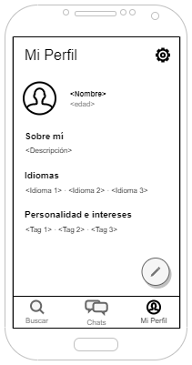

# DIU - Práctica 2. DISEÑO DE BOCETOS: Propuesta de App de Economía Colaborativa

## 1. Malla receptora de información

### ¿Que planteas como "propuesta de valor" para un nuevo diseño de aplicación para economia colaborativa ?
Como propuesta de valor planteamos una app, para compartir experiencias o viajes. Hemos tomado como punto de partida Travello. Nuestra propuesta se basa en simplificar el diseño de la App, el cual era dificil de usar y de adaptarse. En segundo lugar hemos mantenido las funcionalidades básicas de Tavello que si cumplían una función real dentro de la plataforma. En tercer luegar hemos mejorado detalles como que una persona no puede hablar a otra sin una solicitud previa o que a cada usuario se le muestre para cada destino los usuarios mas afines.

## 2. Matriz de tareas/usuarios
|                        | G1: Usuarios jóvenes | G2: Usuarios no casados | G3: Familias |
| ---------------------- | -------------------- | ----------------------- | ------------ |
| Buscar destino         | L/M                  | M                       | M            |
| Chatear                | H                    | H                       | L            |
| Editar perfil          | H                    | M                       | L            |
| Guardar destino        | M                    | L                       | M            |
| Ver destinos guardados | M                    | M                       | M            |
| Reportar/Bloquear      | M                    | M                       | L            |
| Contacto               | M                    | M                       | H            |
| Filtrar destinos       | H                    | M                       | M            |
| Compartir destino      | H                    | L                       | M            |
| Añadir actividades     | L                    | H                       | M            |
| Buscar acompañante     | M                    | H                       | L            |
| Filtrar acompañantes   | M                    | H                       | M            |
| Solicitar chat         | M                    | H                       | L            |

## 3. Arquitectura de la información

### 3.1. Mapa del sitio

### 3.2. Etiquetado
| Término                | Significado                                                  | Icono                                                        |
| ---------------------- | ------------------------------------------------------------ | :----------------------------------------------------------- |
| Busca tu próximo viaje | Es la página de inicio por defecto despues de iniciar sesión. Aquí puedes buscar el destino al que quieras viajar. |  |
| Destinos guardados     | Bóton donde puedes ver todos los destinos que has guardado en Viamos! |  |
| Guardar sitio          | Forma de marcar un sitio como favorito y acceder más rápido e incluso hacer ver a la gente que estás interesado en el destino. |  |
| Encuentra tu sitio     | Esta etiqueta la utilizamos en la página principal para mostrar los destinos más populares, con la finalidad de sugerir al usuario un destino. |                                                              |
| Chats                  | Lugar donde puedes ver la lista de contactos que han aceptado conversar contigo o viceversa. |  |
| Mi perfil              | Lugar donde puedes ver tus datos como una descripción, idiomas, aspectos relacionados con la personalidad e intereses. |  |
| Acompañante            | Usuario de la aplicación que busca otro/s compañeros de viaje. |                                                              |
| Actividades            | Actividades a realizar en un destino.                        |                                                              |
| Enviar                 | Dentro de la ventana de mensajes, enviar hace que el mensaje escrito en la entrada de texto se envie al otro usuario |                                                              |
| Solicitar chat         | Botón que envía una solicitud al otro usuario para iniciar una conversación. Si es aceptada se notificará y el usuario le aparecerá en Chats. |  |
| Contacto               | Página donde puedes encontrar las redes sociales de Viamos! y contactar con nosotros enviando un mensaje. |                                                              |
| Personas interesadas   | Hace referencia al número de personas que tiene guardado un destino. |                                                              |
| Mis actividades        | Lista de actividades que pretendo realizar en el destino indicado. De esta forma es más fácil buscar un acompañante afín a tí. |                                                              |

## 4. Bocetos
") 
 
 
 

### Navegación entre bocetos

