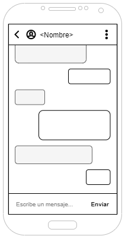

# DIU - Práctica 2. DISEÑO DE BOCETOS: Propuesta de App de Economía Colaborativa

## 1. Malla receptora de información

## 2. Matriz de tareas/usuarios
|                  | G1: Usuarios jovenes | G2: Usuarios no casados | G3: Familias   
|------------------| -------------------- | ------------------------| -------------
Registrarse        | L                    | L                       | L
Buscar experiencia | L/M                  | M                       | M
Chatear            | M                    | H                       | L
Ver/editar perfil  | H                    | M                       | M

## 3. Arquitectura de la información

### 3.1. Mapa del sitio

### 3.2. Etiquetado
  Término      | Significado     
| ------------ | ------------
  Chats        | Listado de conversaciones con otros usuarios de la aplicación.
  Chatear      | Intercambio de mensajes con otro usuario.
  Acompañante  | Usuario de la aplicación que busca otro/s compañeros de viaje.

## 4. Bocetos
") 
 
 
 

