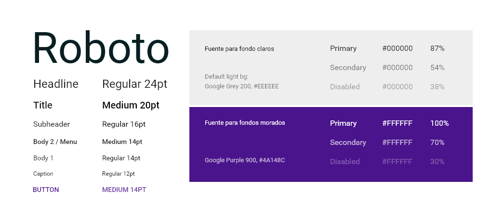
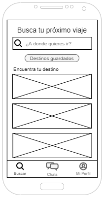
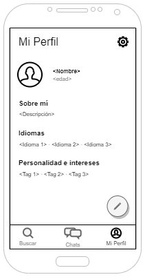
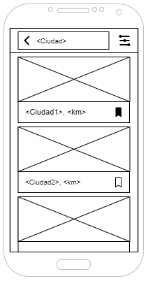
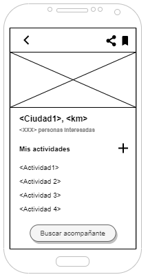
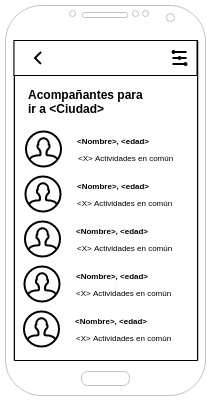
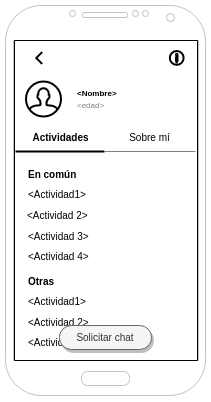
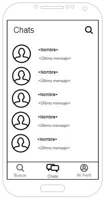
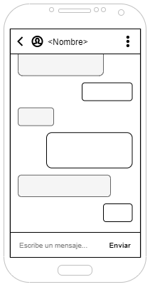

# DIU - Practica 3. Tu	equipo	UX	Case	Study

## 1. Análisis de MuseMap   

## 2. Propuesta de elementos de diseño o patrones a usar 
Las principales líneas de diseño tomadas para este proyecto vienen marcadas por la propuesta de Google, Material Design y donde podemos comprobar que utilizamos varios de los componentes que google aporta con dichas líneas. La fuente que usaremos es Roboto, ya que es la fuente aconsejada por Google. Es clara y admite distintos pesos que podemos utilizar para que nuestro texto sea legible en cualquier situación.

En cuanto a los colores que usaremos en la app vienen marcados por el imagotipo de la aplicación. El color morado (#4A148C, que coincide con el Purple 900 de la paleta de colores propuesta por Google) será el principal de la app, lo usaremos en algunos componentes como Top Bars, Bottom Bars, botones o iconos. El blanco (#FFFFFF) será usado para todos los fondos y tipografía cuando el fondo sea oscuro o morado. En fondos blancos o claros usaremos el color negro (#000000) para la tipografía. En la siguiente imagen podemos observar el uso de la tipografía según su utilización y fondo:

  

Partiendo de los bocetos, destacamos los siguientes patrones y componentes:

  

Página principal (Buscar):
  - Search bar: Utilizamos una barra de busqueda que sugiere nombres de ciuades con las que va coincidiendo la escritura (omitiendo tildes y mayúsculas).
  - Lista (Encuentra tu destino): Lista con imágenes de los destinos más frecuentes en las búsquedas.
  - Bottom Bar: Usamos este componente para un acceso simple al sitio de búsqueda, chats y mi perfil.
 
 

  

Mi perfil:
  - Floating Action Button: Permanece fijo en la pantalla, usado para editar la información del perfil del usuario.
  - Bottom Bar.

  

Resultado de búsqueda:
  - Top Bar con Search bar: Muestra el nombre del destino buscado con posibilidad de editarlo o realizar otra búsqueda. También podemos volver atrás a la página principal y filtrar la búsqueda.
  - Lista de Cards: Esta lista contiene los resultados de la búsqueda que coinciden con el término buscado y mostrando además las ciudades u pueblos más cercanos a dicho término. Cada Card contiene una imagen, un titulo + la distancia a la que se encuentra del usuario que está buscando (si ésta ha dado permiso de localización) y la opción de guardar el destino gracias a un icono.

  

Información de un destino:
  - Top Bar: Con posibilidad de volver atrás, compartir el destino en otras aplicaciones y guardarlo.
  - Gallery: Galeria de imágenes relacionadas con el destino.
  - Lista de actividades: Estas se añaden gracias al icono add.
  - Boton flotante con texto centrado: Características similares al Floating Action Button.

  

Lista de acompañantes:
  - Top Bar: Con posibilidad de volver atrás y filtrar.
  - Lista de Usuarios: Listado de otros usuarios con más compatibilidad para ir al destino indicado. Según las actividades en común en ese destino.

  

Perfil de un acompañante:
  - Tabs: Un tab la lista de actividades comunes para el destino y el resto que no coinciden y otro tab para la información acerca del acompañante.
  - Boton flotante con texto centrado.

  

Chats:
  - Lista de acompañanes: Sirviendo como lista de conversaciones (recividas, enviados, y nuevas conversaciones) (Social chat).

  

Conversación:
  - Lista de mensajes: Mostando de un color los enviados y los recibidos (Social chat).

  
## 3. Historia en Video del UX Case Study

## Documentación. Valoración del equipo sobre la realización de esta práctica o los problemas surgidos
