# DIU - Practica 3. Tu	equipo	UX	Case	Study

## 1. Análisis de MuseMap   
MuseApp es una aplicación cuya función principal es informar a los usuarios  sobre el arte urbano que hay en su entorno. 

El equipo de MuseApp ha realizado un análisis que ha partido desde el supuesto hecho de que el ayuntamiento de Londres les ha contratado. El análisis del equipo de Muse App se ha basado en los siguiente puntos:

- Brainstorming: Han supuesto cuál es su usuario objetivo y las necesidades que este puede tener.

- Competitive Analysis: Han analizado las diferentes opciones que tienen los usuarios que podría hacerle competencia. Para ello en una tabla han comparado las diferentes aplicaciones, con el objetivo de cerciorarse de que funcionalidades son comunes (y por ello potencialmente interesantes de implementar). 

- Empathy Map: Necesario para tener en cuenta cuales son los objetivos que tendría que cumplir la app desde el punto de vista de los usuarios.

- Entrevistas y personas: Tras el análisis anterior y las entrevista que tuvieron con personas que potencialmente podrían ser usuarios de la aplicación. Deciden crear dos personas que engloban en general los aspectos comunes de las personas entrevistadas, con el fin de hacer un análisis más acorde a la realidad.

- Experience Map: Tras sacar objetivos y debilidades de las personas. Realizan el mapa de experiencia gracias al  Journey del usuario y sus emociones. De aquí sacan los problemas para tenerlos en cuenta a la hora de diseñar el User Flow.

- Wireframes: Tras exponer las ideas de cómo debería ser la aplicación, priorizan las funcionalidades que para elaborar los diseños de los bocetos. Realizan 2 iteraciones de bocetos a papel y otras 2 de alta definición con programas especializados en eso.

- Sitemap: Con los bocetos obtenidos realizan el mapa de navegación de los sitios de la aplicación.

- Guidelines: Exponen la tipografía, colores e iconografía que usará la aplicación y con estón elaboran las maquetas finales.

Nosotros como equipo estando en su lugar hubiésemos realizado un análisis bastante similar al de MuseApp. Dentro del apartado de análisis competitivo hubiésemos hecho aunque de manera superficial un usability review solo para no cometer los mismo errores que la competencia. También les falta la malla receptora para aportar sus ideas y propuestas de valor. Respecto a las cosas que no hemos utilizado nosotros, nos llama la atención la entrevista a personas, ya que se puede obtener un punto de vista más realista y quizás un Brainstorming para la generación de ideas para aportar en la propuesta de valor y mejorar las personas que inventamos.

## 2. Propuesta de elementos de diseño o patrones a usar 
Las principales líneas de diseño tomadas para este proyecto vienen marcadas por la propuesta de Google: [Material Design](https://material.io), donde podemos comprobar que utilizamos varias de las directrices que google nos aporta en su página oficial.

### 2.1. Colores
El color principal de la aplicación de Viamos! parte del Imagotipo que es un violeta 900 de la [paleta de colores Material Design](https://material.io/design/color/the-color-system.html#tools-for-picking-colors). También hacemos uso de otro color, el cual es una variación clara del violeta 900 que usaremos mayoritariamente para botones.

  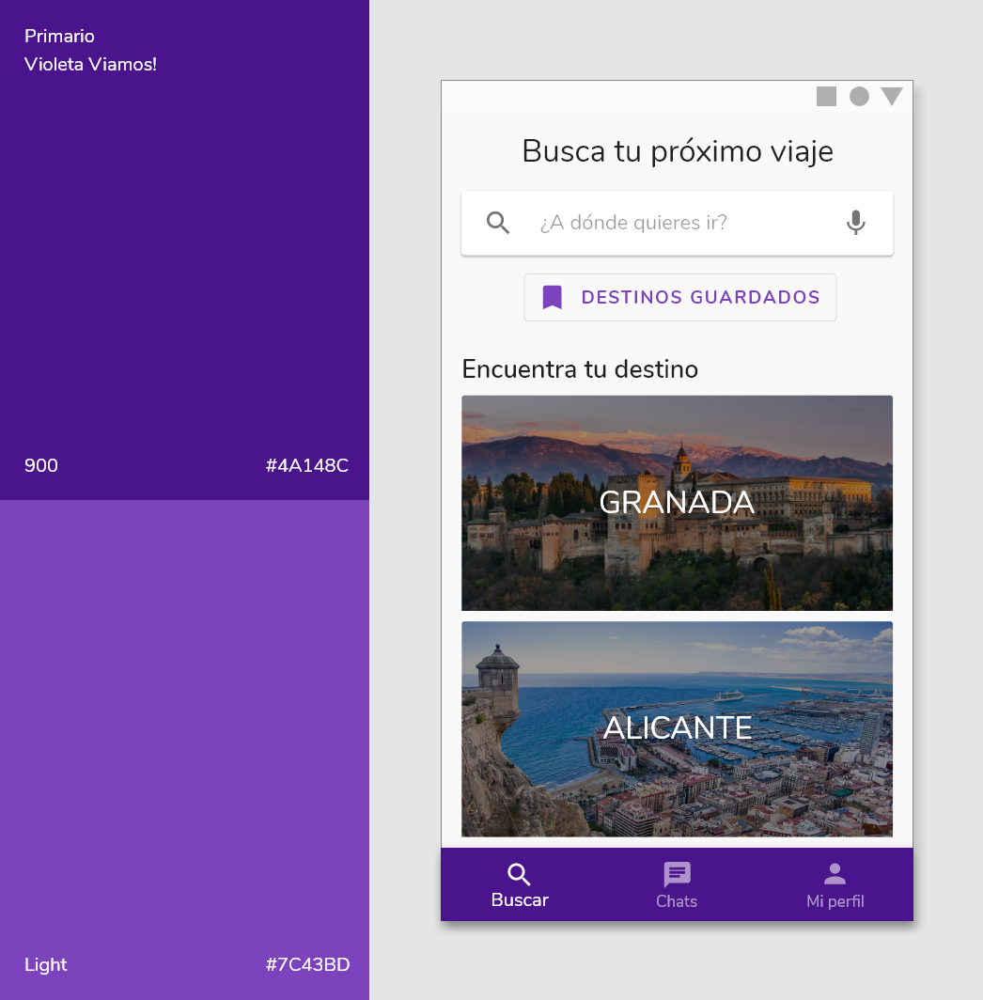

### 2.2. Tipografía

Viamos! usa [Nunito](https://fonts.google.com/specimen/Nunito) para su logotipo y también lo usa para la aplicación, es una tipografía redondeada y con muchos pesos a elegir, pudiéndolo aplicar para distintas cosas de la aplicación.

Los tamaños usados en la aplicación y su uso vienen marcados por la siguiente imagen:

  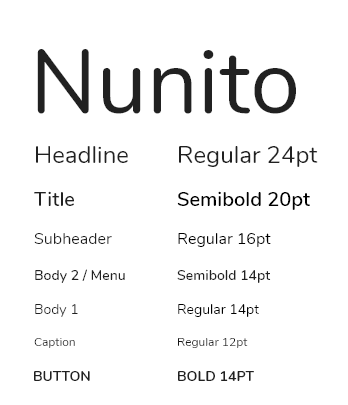

### 2.3. Iconografía
Los iconos usados en Viamos! son los predeterminados por Material Design usando el tema Redondeados para tener una mayor coherencia con la tipografía. Aquí más información de [Material Icons](https://material.io/resources/icons/?style=round).

  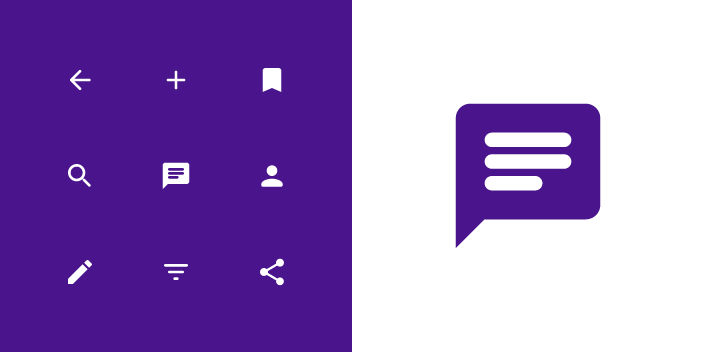

### 2.4. Componentes
Partiendo de los bocetos, destacamos los siguientes [componentes](https://material.io/components) que usamos en Viamos!:

  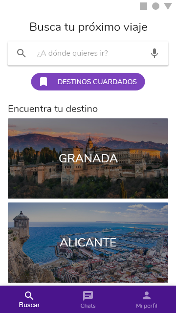

Página principal (Buscar):
  1. SEARCH BAR: Utilizamos una barra de busqueda que sugiere nombres de ciuades con las que va coincidiendo la escritura (omitiendo tildes y mayúsculas).
  2. OUTLINED BUTTON: Para visualizar los destinos guardados.
  3. IMAGE LIST: Lista con imágenes de los destinos más frecuentes en las búsquedas.
  4. BOTTOM BAR: Usamos este componente para un acceso simple al sitio de búsqueda, chats y mi perfil.
 
 

  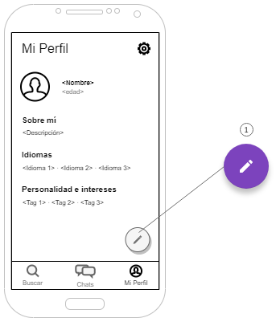

Mi perfil:
  1. Floating Action Button: Permanece fijo en la pantalla, usado para editar la información del perfil del usuario.

  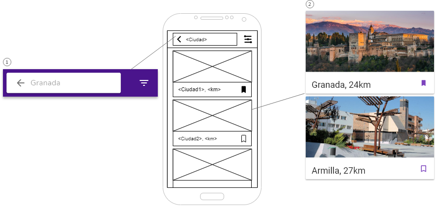

Resultado de búsqueda:
  1. TOP BAR WITH SEARCH BAR: Muestra el nombre del destino buscado con posibilidad de editarlo o realizar otra búsqueda. También podemos volver atrás a la página principal y filtrar la búsqueda.
  2. CARD LIST: Esta lista contiene los resultados de la búsqueda que coinciden con el término buscado y mostrando además las ciudades u pueblos más cercanos a dicho término. Cada Card contiene una imagen, un titulo + la distancia a la que se encuentra del usuario que está buscando (si ésta ha dado permiso de localización) y la opción de guardar el destino gracias a un icono.

  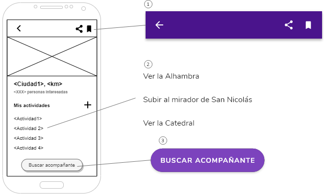

Información de un destino:
  1. TOP BAR: Con posibilidad de volver atrás, compartir el destino en otras aplicaciones y guardarlo.
  2. TEXT LIST: Estas se añaden gracias al icono add.
  3. EXTENDED FLOATING ACTION BUTTON: Características similares al Floating Action Button.

  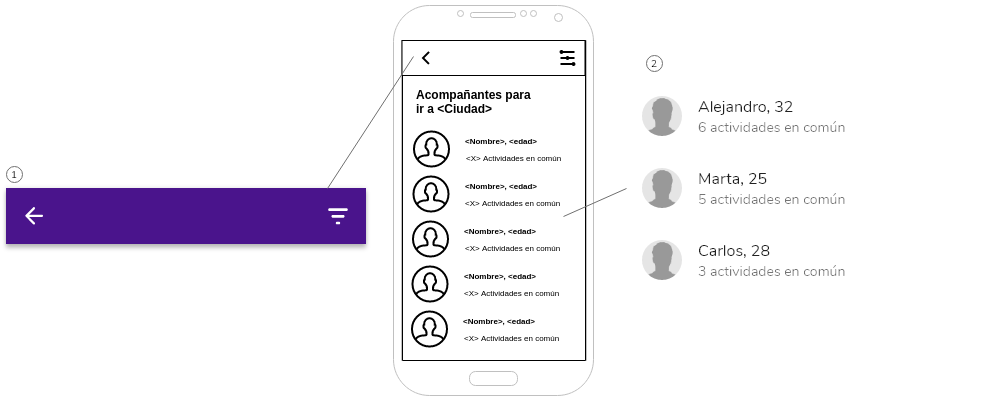

Lista de acompañantes:
  1. TOP BAR: Con posibilidad de volver atrás y filtrar.
  2. USER LIST: Listado de otros usuarios con más compatibilidad para ir al destino indicado. Según las actividades en común en ese destino.

  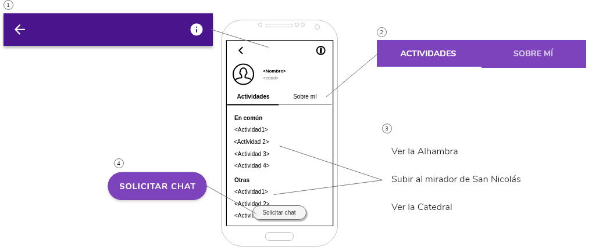

Perfil de un acompañante:
  1. TOP BAR: Con opción de ir atrás e informar acerca del usuario.
  2. TABS: Un tab para la lista de actividades comunes para el destino buscado y el resto que no coinciden y otro tab para la información acerca del acompañante.
  3. TEXT LIST: Lista de actividades del usuario.
  4. EXTENDED FLOATING ACTION BUTTON.

  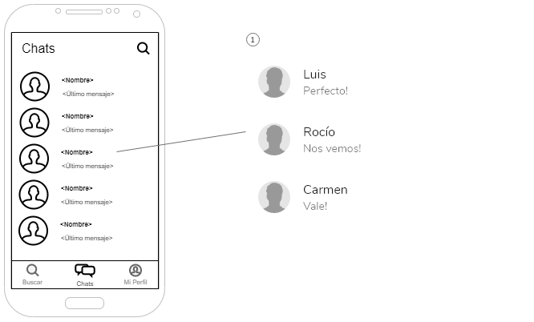

Chats:
  1. USER LIST: Sirviendo como lista de conversaciones (recividas, enviados, y nuevas conversaciones) (Social chat).

  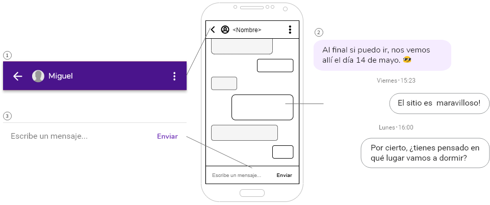

Conversación:
  1. TOP BAR: Con opción de volver atrás, ver perfil del usuario (icono de la persona) y un menú para otros ajustes (tres puntos).
  2. MESSAGE LIST: Mostando de un color los enviados y los recibidos (Social chat).
  3. TEXT FIELD WITH SEND BUTTON: Para enviar mensajes.

  
## 3. Historia en Video del UX Case Study

Para conocernos y conocer Viamos! mejor puedes ver sl siguiente [vídeo](https://drive.google.com/file/d/1mYiTo1P7g_P5IthVuXjFCIaOzzB5WR5x/view?usp=sharing).

## Valoración del equipo sobre la realización de esta práctica o los problemas surgidos
Esta práctica es la que más nos ha gustado, hemos visto las cosas que podríamos haber mejorado gracias al estudio de MuseApp. Por otro lado, hemos apredrido mejor dictar unas líneas de diseño, ya que antes de empezar la práctica no lo teníamos muy claro.
