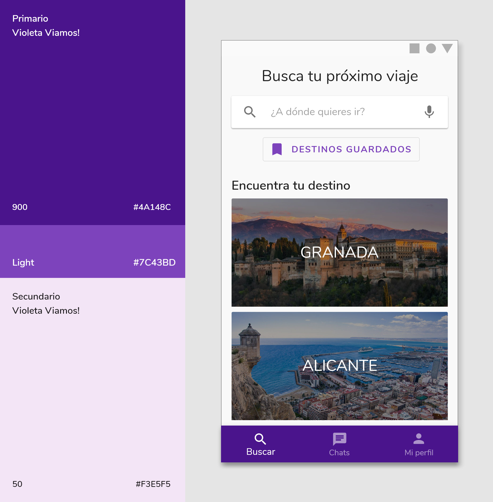
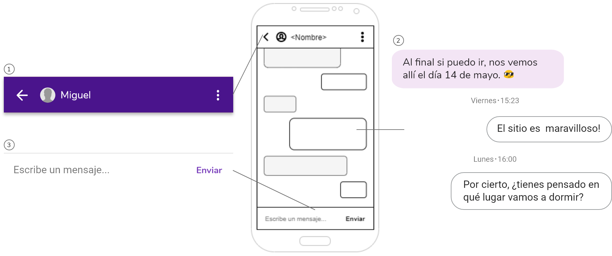

# DIU - Practica 3. Tu	equipo	UX	Case	Study

## 1. Análisis de MuseMap   

## 2. Propuesta de elementos de diseño o patrones a usar 
Las principales líneas de diseño tomadas para este proyecto vienen marcadas por la propuesta de Google: [Material Design](https://material.io), donde podemos comprobar que utilizamos varias de las directrices que google nos aporta en su página oficial.

### 2.1. Colores
El color principal de la aplicación de Viamos! parte del Imagotipo que es un violeta 900 de la [paleta de colores Material Design](https://material.io/design/color/the-color-system.html#tools-for-picking-colors). También hacemos uso de otro color, el cual es una variación clara del violeta 900 que usaremos mayoritariamente para botones.

  

### 2.2. Tipografía

Viamos! usa [Nunito](https://fonts.google.com/specimen/Nunito) para su logotipo y también lo usa para la aplicación, es una tipografía redondeada y con muchos pesos a elegir, pudiéndolo aplicar para distintas cosas de la aplicación.

Los tamaños usados en la aplicación y su uso vienen marcados por la siguiente imagen:

  

### 2.3. Iconografía
Los iconos usados en Viamos! son los predeterminados por Material Design usando el tema Redondeados para tener una mayor coherencia con la tipografía. Aquí más información de [Material Icons](https://material.io/resources/icons/?style=round).

  

### 2.4. Componentes
Partiendo de los bocetos, destacamos los siguientes [componentes](https://material.io/components) que usamos en Viamos!:

  

Página principal (Buscar):
  1. SEARCH BAR: Utilizamos una barra de busqueda que sugiere nombres de ciuades con las que va coincidiendo la escritura (omitiendo tildes y mayúsculas).
  2. OUTLINED BUTTON: Para visualizar los destinos guardados.
  3. IMAGE LIST: Lista con imágenes de los destinos más frecuentes en las búsquedas.
  4. BOTTOM BAR: Usamos este componente para un acceso simple al sitio de búsqueda, chats y mi perfil.
 
 

  

Mi perfil:
  1. Floating Action Button: Permanece fijo en la pantalla, usado para editar la información del perfil del usuario.

  

Resultado de búsqueda:
  1. TOP BAR WITH SEARCH BAR: Muestra el nombre del destino buscado con posibilidad de editarlo o realizar otra búsqueda. También podemos volver atrás a la página principal y filtrar la búsqueda.
  2. CARD LIST: Esta lista contiene los resultados de la búsqueda que coinciden con el término buscado y mostrando además las ciudades u pueblos más cercanos a dicho término. Cada Card contiene una imagen, un titulo + la distancia a la que se encuentra del usuario que está buscando (si ésta ha dado permiso de localización) y la opción de guardar el destino gracias a un icono.

  

Información de un destino:
  1. TOP BAR: Con posibilidad de volver atrás, compartir el destino en otras aplicaciones y guardarlo.
  2. TEXT LIST: Estas se añaden gracias al icono add.
  3. EXTENDED FLOATING ACTION BUTTON: Características similares al Floating Action Button.

  

Lista de acompañantes:
  1. TOP BAR: Con posibilidad de volver atrás y filtrar.
  2. USER LIST: Listado de otros usuarios con más compatibilidad para ir al destino indicado. Según las actividades en común en ese destino.

  

Perfil de un acompañante:
  1. TOP BAR: Con opción de ir atrás e informar acerca del usuario.
  2. TABS: Un tab para la lista de actividades comunes para el destino buscado y el resto que no coinciden y otro tab para la información acerca del acompañante.
  3. TEXT LIST: Lista de actividades del usuario.
  4. EXTENDED FLOATING ACTION BUTTON.

  

Chats:
  1. USER LIST: Sirviendo como lista de conversaciones (recividas, enviados, y nuevas conversaciones) (Social chat).

  

Conversación:
  1. TOP BAR: Con opción de volver atrás, ver perfil del usuario (icono de la persona) y un menú para otros ajustes (tres puntos).
  2. MESSAGE LIST: Mostando de un color los enviados y los recibidos (Social chat).
  3. TEXT FIELD WITH SEND BUTTON: Para enviar mensajes.

  
## 3. Historia en Video del UX Case Study

## Documentación. Valoración del equipo sobre la realización de esta práctica o los problemas surgidos
