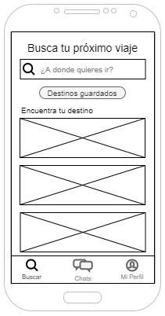

# DIU20
Prácticas Diseño Interfaces de Usuario 2019-20 (Economía Colaborativa) 

Grupo: HORAPI  Curso: 2019/20 

Proyecto: Viamos!

Descripción: El objetivo del producto es que encuentres uno o varios acompañantes para un viaje que deseas realizar. Además, indicar las actividades que quieres hacer en dicho viaje servirá para aconsejarte de acompañantes con actividades similares o incluso intereses comunes.

Imagotipo:

  

Miembros
 * :bust_in_silhouette:  Diego García Aurelio          :octocat: diegogaraur  
 * :bust_in_silhouette:  Miguel Ángel Mena Barrera     :octocat: MenaBarrera

----- 

Qué es economia colaborativa: Martínez-Polo, J. (2019). **El fenómeno del consumo colaborativo: del intercambio de bienes y servicios a la economía de las plataformas**, *Sphera Publica, 1*(19), 24-46. http://sphera.ucam.edu/index.php/sphera-01/article/view/363/14141434

# Proceso de Diseño 

## Paso 1. UX Desk Research & Analisis 

 1.a Competitive Analysis
-----

Hemos escogido como aplicación para analizar *Travello* una red social de viajes y experiencias.

 1.b Persona
-----
Hemos escogido estas dos experiencias de usuario, ateniendonos a perfiles que entre sí son distintos. Uno de ellos (Kevin) esta mas relacionado con un estudiante como nosotros. La otra persona, es adulta y soltera, creemos que encaja dentro del perfil de los usuarios que puede tener la aplicación.

   

Para ver las personas con más detalle pulsa [aquí](P1/README.md). (Apartado 2. Personas)

 1.c User Journey Map
----

 1.d Usability Review
----

- [Enlace al documento](P1/Usability%20scores.pdf)
- Valoración final (numérica): 62/100 - Moderate
- Comentario sobre la valoración: Comenzando por las cosas buenas de la aplicación, destacamos los formularios, que son bastantes completos y tienen los formatos correctos. Y por otro lado, la navegación está correcta, el usuario puede encontrar la aplicación correctamente y dentro de la aplicación es posible acceder a los distintas funcionalidades de manera rápida, quizás como pega pondríamos que tiene demasiados sitios. En cuanto a las cosas que destacamos como más pobres están el contenido, que flojea como información útil; Las búsquedas no se resuelven lo suficientemente bien y muchas de las funcionalidades acaban siendo demasiado complejas. El resto de aspectos no comentados, los vemos de forma moderada.

## Paso 2. UX Design  

 2.a Feedback Capture Grid
----

  

  
### ¿Que planteas como "propuesta de valor" para un nuevo diseño de aplicación para economia colaborativa ?
Como propuesta de valor planteamos una app, para compartir experiencias o viajes. Hemos tomado como punto de partida Travello. Nuestra propuesta se basa en simplificar el diseño de la App, el cual era dificil de usar y de adaptarse. En segundo lugar hemos mantenido las funcionalidades básicas de Tavello que si cumplían una función real dentro de la plataforma. En tercer luegar hemos mejorado detalles como que una persona no puede hablar a otra sin una solicitud previa o que a cada usuario se le muestre para cada destino los usuarios mas afines.

 2.b Tasks & Sitemap 
-----

### User tasks
|                  | G1: Usuarios jovenes | G2: Usuarios no casados | G3: Familias   
|------------------| -------------------- | ------------------------| -------------
Registrarse        | L                    | L                       | L
Buscar experiencia | L/M                  | M                       | M
Chatear            | M                    | H                       | L
Ver/editar perfil  | H                    | M                       | M

L:Low M:Moderate H:High

### Sitemap

  

 2.c Labelling 
----

  Término      | Significado     
| ------------ | ------------
  Chats        | Listado de conversaciones con otros usuarios de la aplicación.
  Chatear      | Intercambio de mensajes con otro usuario.
  Acompañante  | Usuario de la aplicación que busca otro/s compañeros de viaje.

 2.d Wireframes
-----

 
 
 
 

## Paso 3. Mi equipo UX-Case Study 

 3.a ¿Como se cuenta un UX-Case Study?
-----

Nosotros como equipo estando en su lugar hubiésemos realizado un análisis bastante similar al de MuseApp. Dentro del apartado de análisis competitivo hubiésemos hecho aunque de manera superficial un usability review solo para no cometer los mismo errores que la competencia. También les falta la malla receptora para aportar sus ideas y propuestas de valor. Respecto a las cosas que no hemos utilizado nosotros, nos llama la atención la entrevista a personas, ya que se puede obtener un punto de vista más realista y quizás un Brainstorming para la generación de ideas para aportar en la propuesta de valor y mejorar las personas que inventamos.
Para conocer mejor el Ux-Case Study de MuseApp pulsa [aquí](P3/README.md#1-análisis-de-musemap)

  3.b Imagotipo
----

Para la realización del logotipo se ha usado Affinity Designer para realizar las formas del isotipo y Adobe Illustrator para finalizar todo el diseño del imagotipo (refinar el isotipo, añadir el logotipo y realizar las distintas versiones). El logotipo parte de la idea de Viajar + Vamos = Viamos, todo esto hace incapié en que está en primera persona del plural para que se destaque la inclusión, ya que la aplicación tiene como objetivo que una persona encuentre compañeros de viaje. Por otro lado, en el imagotipo se puede ver como se forma una flecha que señala a un punto o viéndolo de otra forma, como tres caminos de personas distintas que se acaban juntando para llegar a un mismo punto. El punto simboliza el destino al que se quiere llegar.

  
  

  
  

Estas imágenes estaría bien usarlas como foto de perfil de las redes sociales, pero para casos como el encabezado de Twitter sería mejor usar otro tipo de recursos ya que sino obtendríamos un perfil con el Logotipo/Imagotipo demasiado repetitivo.

 3.c Guidelines
----

Las principales líneas de diseño tomadas para este proyecto vienen marcadas por la propuesta de Google: [Material Design](https://material.io), donde podemos comprobar que utilizamos varias de las directrices que google nos aporta en su página oficial.

- [Colores](P3/README.md#21-colores):
  - Color primario: #4A148C (Violeta 900 de la paleta de colores Material Design)
  - Variante Light: #7C43BD
  
- [Tipografía](P3/README.md#22-tipografía): Nunito

- [Iconografía](P3/README.md#23-iconografía): Material Icons Rounded

- [Principales componentes](P3/README.md#24-componentes):
  Search bar, Outlined button, Image list, Bottom bar, FAB, Card list, Top bar, Text list, Extended FAB, Tabs, Users list, Message list y text field entre otros.

Para más información pulse los títulos de cada apartado.

  3.d Video
----

>>> Documente y resuma el diseño de su producto en forma de video de 90 segundos aprox

## Paso 4. Evaluación 

 4.a Casos asignados
----

>>> Descripción de las asignaciones (3 UX Case Study) y enlace a  sus repositorios.

>>>> En la seccioón P4/readme.md se debe acceder además a sus respectivas hojas de evaluación y conclusiones 

 4.b User Testing
----

>>> Seleccione a una de sus personas ficticias. Exprese las ideas de posibles situaciones conflictivas de esa persona en las propuestas evaluadas

 4.c Ranking 
----

>>> Concluya con un ranking de los casos evaluados 

>>> Valoración personal 

## Conclusión final / Valoración de las prácticas

>>> (90-150 palabras) Opinión del proceso de desarrollo de diseño siguiendo metodología UX y valoración (positiva /negativa) de los resultados obtenidos  
