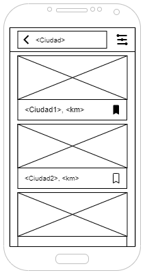
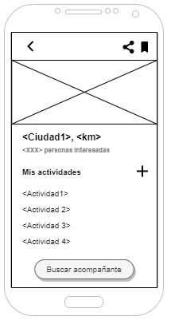

# DIU20
Prácticas Diseño Interfaces de Usuario 2019-20 (Economía Colaborativa) 

Grupo: HORAPI  Curso: 2019/20 

Proyecto: Viamos!

Descripción: El objetivo del producto es que encuentres uno o varios acompañantes para un viaje que deseas realizar. Además, indicar las actividades que quieres hacer en dicho viaje servirá para aconsejarte de acompañantes con actividades similares o incluso intereses comunes.

Logotipo: 

Miembros
 * :bust_in_silhouette:  Diego García Aurelio          :octocat: diegogaraur  
 * :bust_in_silhouette:  Miguel Ángel Mena Barrera     :octocat: MenaBarrera

----- 

Qué es economia colaborativa: Martínez-Polo, J. (2019). **El fenómeno del consumo colaborativo: del intercambio de bienes y servicios a la economía de las plataformas**, *Sphera Publica, 1*(19), 24-46. http://sphera.ucam.edu/index.php/sphera-01/article/view/363/14141434

# Proceso de Diseño 

## Paso 1. UX Desk Research & Analisis 

 1.a Competitive Analysis
-----

Hemos escogido como aplicación para analizar *Travello* una red social de viajes y experiencias.

 1.b Persona
-----
Hemos escogido estas dos experiencias de usuario, ateniendonos a perfiles que entre sí son distintos. Uno de ellos (Kevin) esta mas relacionado con un estudiante como nosotros. La otra persona, es adulta y soltera, creemos que encaja dentro del perfil de los usuarios que puede tener la aplicación.

 1.c User Journey Map
----

 1.d Usability Review
----
>>>  Revisión de usabilidad: (toma los siguientes documentos de referncia y verifica puntos de verificación de  usabilidad
>>>> SE deben incluir claramente los siguientes elementos
>>> - Enlace al documento:  (sube a github el xls/pdf) 
>>> - Valoración final (numérica): 
>>> - Comentario sobre la valoración:  (60-120 caracteres)

## Paso 2. UX Design  

 2.a Feedback Capture Grid
----

  
### ¿Que planteas como "propuesta de valor" para un nuevo diseño de aplicación para economia colaborativa ?
Como propuesta de valor planteamos una app, para compartir experiencias o viajes. Hemos tomado como punto de partida Travello. Nuestra propuesta se basa en simplificar el diseño de la App, el cual era dificil de usar y de adaptarse. En segundo lugar hemos mantenido las funcionalidades básicas de Tavello que si cumplían una función real dentro de la plataforma. En tercer luegar hemos mejorado detalles como que una persona no puede hablar a otra sin una solicitud previa o que a cada usuario se le muestre para cada destino los usuarios mas afines.

 2.b Tasks & Sitemap 
-----

### User task
|                  | G1: Usuarios jovenes | G2: Usuarios no casados | G3: Familias   
|------------------| -------------------- | ------------------------| ----------
Registrarse        | L | L | L
Buscar experiencia | L/M | M | M
Chatear            | M | H | L
Ver/editar perfil  | H | M | M

L:Low M:Moderate H:High

### Sitemap

 2.c Labelling 
----

Término | Significado     
| ------------- | -------
  Chats  | Listado de conversaciones con otros usuarios de la aplicación.
  Chatear  | Intercambio de mensajes con otro usuario.
  Acompañante  | Usuario de la aplicación que busca otro/s compañeros de viaje.

 2.d Wireframes
-----

 
 
 
 

## Paso 3. Mi equipo UX-Case Study 

 3.a ¿Como se cuenta un UX-Case Study?
-----

>>> Analizar lo aprendido de la experiencia MuseApp 

  3.b Logotipo
----

>>> Si diseña un logotipo, explique la herramienta utilizada y la resolución empleada. ¿Puede usar esta imagen como cabecera de Twitter, por ejemplo, o necesita otra?

 3.c Guidelines
----

>>> Tras documentarse, muestre las deciones tomadas sobre Patrones IU a usar para la fase siguiente de prototipado. 

  3.d Video
----

>>> Documente y resuma el diseño de su producto en forma de video de 90 segundos aprox

## Paso 4. Evaluación 

 4.a Casos asignados
----

>>> Descripción de las asignaciones (3 UX Case Study) y enlace a  sus repositorios.

>>>> En la seccioón P4/readme.md se debe acceder además a sus respectivas hojas de evaluación y conclusiones 

 4.b User Testing
----

>>> Seleccione a una de sus personas ficticias. Exprese las ideas de posibles situaciones conflictivas de esa persona en las propuestas evaluadas

. 4.c Ranking 
----

>>> Concluya con un ranking de los casos evaluados 

>>> Valoración personal 

## Paso 5. Evaluación de Accesibilidad  

  5.a Accesibility evaluation Report
----

>>> Indica qué pretendes evaluar (de accesibilidad) y qué resultados has obtenido + Valoración personal

>>> Evaluación de la Accesibilidad (con simuladores o verificación de WACG) 

## Conclusión final / Valoración de las prácticas

>>> (90-150 palabras) Opinión del proceso de desarrollo de diseño siguiendo metodología UX y valoración (positiva /negativa) de los resultados obtenidos  
